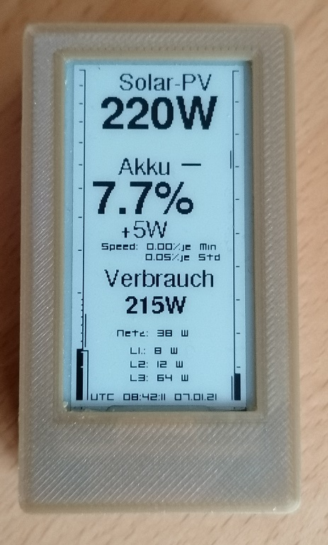

# Fronius Gen24 Display on TTGO T5 V2.3 eInk-Display

The Code is not pretty - I`m not a professional Coder - but it works fine ;-)

### Attention
You have to adjust Section "User-Config" before upload.

### Housing
I used this on Thingiverse: 
https://www.thingiverse.com/thing:4055993

